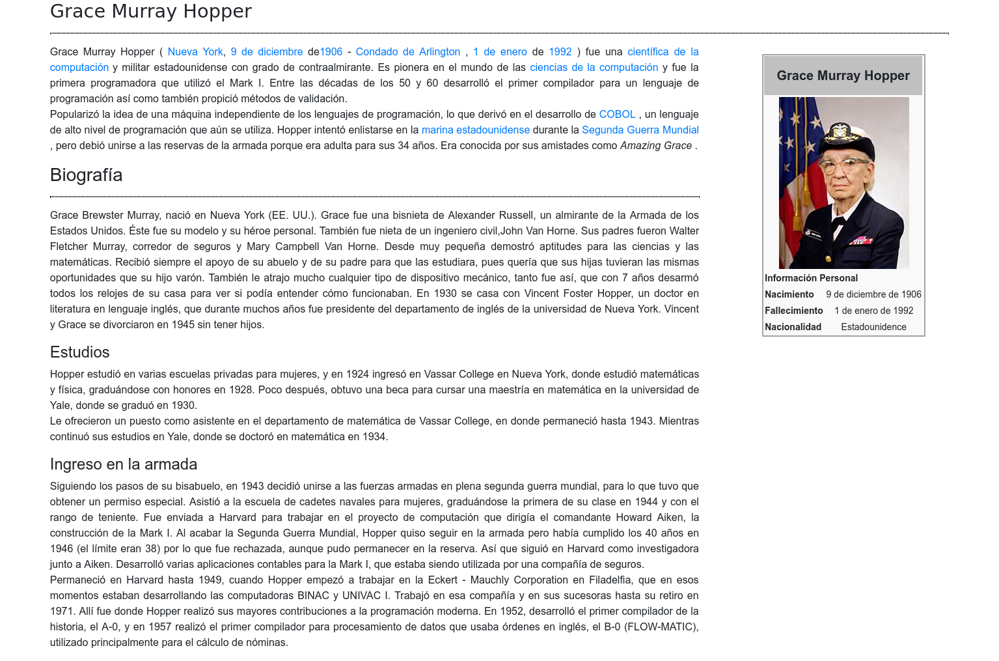

# Página web Grace Hopper with React

## Objetivo :
La página web de Grace Hopper cuenta con 3 componentes.  

- Header: Contiene la etiqueta `header` con el nombre de Grace Hopper.

- Main:  Contiene el texto principal de la página dentro de la etiqueta `main`.

- Aside: Contiene una tabla con datos biográficos, la tabla se encuentra dentro de la etiqueta `aside`.

Los 3 componentes son importados al componente App para colocarlos según el orden que se mostrará en la página web.

## Screen capture de mi trabajo final
